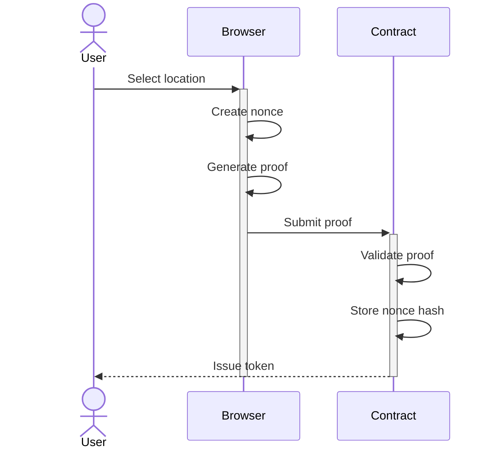

# Where In The World

A ZK circuit that let's you prove you know where in the world a picture was taken.

## How it works

The game is simple: you are given a picture and a map of the world. You must click on the map where you think the picture was taken. If you are correct, you can claim a token.

The real magic of this game is that you can prove you know where the picture was taken without revealing the location to anyone else. This is done using a ZK circuit that takes the latitude and longitude of the location and securely hashes it. The hash is used to determine if the location is correct or not. The circuit also includes a nonce to prevent replay attacks.

Your browser will generate a proof that you know the hash of the location and submit it on chain. The smart contract will verify the proof and if it is correct, you will be issued a token.

## Usage

This repository contains three packages: `circuits`, `contracts`, and `web`.

To build the project, follow the instructions of each package in the following order:

1. [circuits](./packages/circuits/README.md)
2. [contracts](./packages/contracts/README.md)
3. [web](./packages/web/README.md)

### Circuits

The `circuits` package contains the ZK circuit that lets you prove you know where in the world a picture was taken.

### Contracts

The `contracts` package contains the Solidity contracts for on chain interactions with the ZK circuit.

### Web

The `web` package contains the web application that lets you play the game and interact with the ZK contracts.
